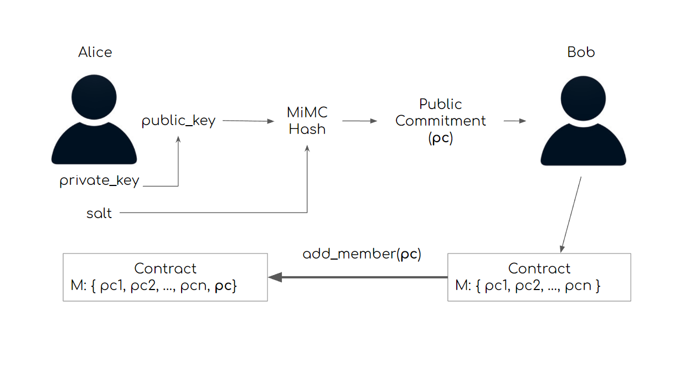
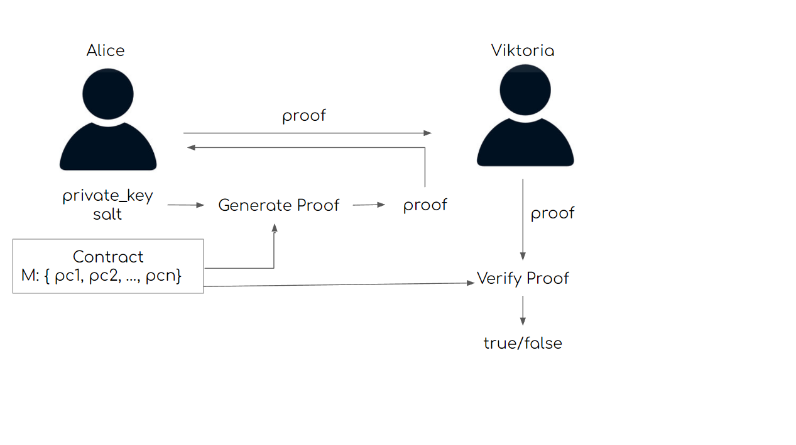

<p align="center">
  
</p>

# vStudio-metabuild

This repo contains source code of the zero-knowledge proofs vSelf SDK.  relevant documentation that was created durign METABUILD hackathon.

## Privacy preserving onboarding

We wish to demonstrate our design and implementation of an advanced community members onboarding flow that preserves some privacy for participants.

1. Any user creates community with 0 members providing proper description.
2. People can use demo app to generate secret memebershipKey and pass it to community of choice.



3. People can prove in zero-knwoledge their membership and recieve on-chain non-transferable NFT badge to account of their choosing. Currently both verification and proof generation are made on vStudio side.



## Our code and deliverables

### Frontend ([DEMO](https://zkp-demo.web.app/))

Frontend application is built using Next.js metaframework and authorization is done via WalletSelector package maintained by NEAR. Frontend uses our public npm package for all
client side cryptography. Also we used [T3 Stack](https://github.com/t3-oss/create-t3-app) boilerplate to add Typescript and Tailwind
CSS support.

### Smart contract

Smart contract is deployed to testnet and is responsible for managing on-chain data. Currently it holds explicit list of membeship commitments for every community created. Each user can create any number of communities under ones control. Contract is implemented in Rust using [near-rs-sdk v4](https://github.com/near/near-sdk-rs), our source code and tests are in /contract folder of this repo.

Deployed to: [communities_v4.sergantche.testnet](https://explorer.testnet.near.org/accounts/communities_v4.sergantche.testnet)

### Shared ZKP utils

We've developed our Rust implementation of non-interactive ZK proof-of-set-membership and [MiMC](https://byt3bit.github.io/primesym/mimc/) hash preimage, compiled it into WebAssembly and published the resulting package to NPM. Biggest thanks to original bulletproof impelemntation of [dalek](https://github.com/zkcrypto/bulletproofs) and for great source of R1CS gadget examples by [lovesh](https://github.com/lovesh/bulletproofs-r1cs-gadgets)

The package source code availible inside /shared-utils folder, and contains cryptographic building blocks we used for our solution along with automated tests.

It's availible for download at [npm registry](https://www.npmjs.com/package/@vself_project/shared-utils). Currently it exports following functions:

```js
1. mimc_hash(bigint left, bigint right) => Commitment
2. prove_mimc_preimage(bigint secret, bigint salt) => Proof
3. verify_mimc_preimage(Commitment c, Proof p) => bool
4. prove_set_membership(Vec<Commitment> set, bigint secret, bigint salt) => MembershipProof
5. verify_set_membership(Vec<Commitment> set, MembershipProof p) => bool
```

## Future plans

Our major intention to make this our library also runnable but we are having hopes to run verification)

There are two major improvements we have in mind at the momement for cryptography R&D:

1. Implementing Verkle trie as replacement for commitments accumulator, which allows us to scale size of community as proofs would have constant size independent of set size. Bulletproofs use Pedersen commitments as a part of a protocol which makes implementation pretty staightforward.

2. Implementing proof-of-ownership of a public key, which will allow for interesting use cases (e.g. designated verifier proofs or consentual airdrops) on NEAR as it uses this particular curve (Ed25519).
